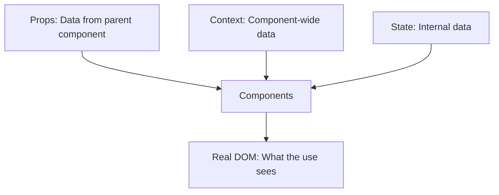
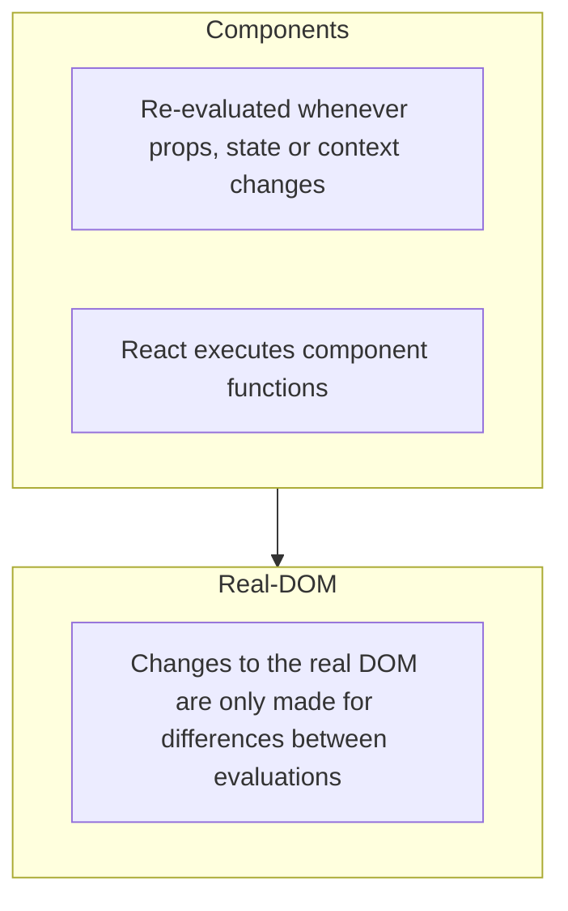

<!-- @format -->

這章節將進一步介紹 React 底層的運作方式，透過了解這些觀念，有助於我們更正確的使用 React 來開發專案

<!-- more -->

## How React really work?

在透過 create-react-app 建立 React 專案時，預設會安裝兩個與 React 有關的套件，分別是 React 核心 react 與 react-dom，在 react 核心中，其實並不會直接處理 DOM 相關內容，更直接的說法是不會和瀏覽器之間有互動，react 核心只負責處理 react 開發時的基本單位 - Components，而 Components 會處理所有資料來源，如下圖所示:



- Props: 來自父元件的資料
- Context: Component 共用的資料
- State: Component 內部的資料

而在 react 核心處理完 Components 資料時，每當有資料上的更新，就會產生重新執行 component function，產生 React Virtual DOM，並比對更新前後的差異，再由 react-dom 來更新實際 DOM 不同之處;因為更新實際 DOM 的效能成本是很高的，因此先由比對 React Virtual DOM 的差異，再更新實際 DOM 必要之處，就可以盡可能的減少效能上的消耗，所以重新執行 component function 並不等於重新選染 DOM



## Child Component Re-evaluation

前面提到，當 component 關聯的資料發生異動時，component function 都會被再次呼叫，return 中的 JSX 也會再次被回傳，這代表其中的 child component 也會再次呼叫 component function，一個簡單的範例如下，透過 parent component State 來控制 child component 的存在與否

```js
// App.js
import React, { useState } from "react";
import DemoOoutput from "./components/Demo/DemoOutput";
import Button from "./components/UI/Button/Button";

function App() {
  const [showParagraph, setShowParagraph] = useState(false);

  console.log("APP RUNNING");

  const toggleParagraphHandler = () => {
    setShowParagraph((prevShowParagraph) => !prevShowParagraph);
  };

  return (
    <div className="app">
      <h1>Hi there!</h1>
      <DemoOoutput show={showParagraph} />
      <Button onClick={toggleParagraphHandler}>Toggle ParaGraph!</Button>
    </div>
  );
}

// DemoOutput.js
import React from "react";

const DemoOoutput = (props) => {
  console.log("DEMOOUTPUT RUNNING");

  return <p>{props.show ? "This is new!" : ""}</p>;
};
```


這樣的範例可能會很直覺地認為因為 child component 所屬的 props state 發生異動，所以 child component function 自然也會再次呼叫，但當我們將這個 props 改成固定值，也就是無論 parent component state 如何變動，child component 的值也不受影響

```js
// App.js
function App() {
  const [showParagraph, setShowParagraph] = useState(false);

  console.log("APP RUNNING");

  const toggleParagraphHandler = () => {
    setShowParagraph((prevShowParagraph) => !prevShowParagraph);
  };

  return (
    <div className="app">
      <h1>Hi there!</h1>
      <DemoOoutput show={false} />
      <Button onClick={toggleParagraphHandler}>Toggle ParaGraph!</Button>
    </div>
  );
}
```

結果仍然會發現，child component 即使值未受影響，component function 依然被呼叫了! 因為當 component 因資料異動所觸發的 re-evaluation，其 JSX 中的 child component 也是這個 component 的一部分，自然也會跟著再次呼叫，這裡就指出了一個問題，如果在上層有太多非必要的資料異動，勢必會接連帶動與資料無關的 child component 發生 re-evaluation，進而造成效能上的浪費。

## Preventing Unnecessary Re-Evaluation with React.memo()

為了解決上述的問題，React 提供了一個方法 - `React.memo()` 來解決這個問題，只需要在非必要 re-render child component 內的 `export` 中，透過 `React.memo()` 回傳 component function，就可以避免這種情況發生

```js
import React from "react";

const DemoOoutput = (props) => {
  console.log("DEMOOUT RUNNING");

  return <p>{props.show ? "This is new!" : ""}</p>;
};

export default React.memo(DemoOoutput);
```

### 使用時機

既然這個方法可以避免因非必要的呼叫所造成的效能消耗，那為什麼我們不在所有 child component 這麼使用呢 ? 因為這個方法其實也有他的效能成本，為了比較資料是否有變動，勢必就要儲存舊的資料，所以如果這個 component 無論什麼情況都會發生 re-evaluation，那這麼做就只是造成多餘的效能消耗而已了。

### 使用限制

除此之外，`React.memo()` 還有另一個使用上的限制，同樣的方法套用到另一個資料也沒有改動的 component Button 中，會發現 component function 還是被執行了

```js
import React from "react";

import classes from "./Button.module.css";

const Button = (props) => {
  console.log("BUTTON RUNNING");
  return (
    <button
      type={props.type || "button"}
      className={`${classes.button} ${props.className}`}
      onClick={props.onClick}
      disabled={props.disabled}
    >
      {props.children}
    </button>
  );
};

export default React.memo(Button);
```

原因其實不在於 React 的特性，而是在於 `React.memo()` 其實是單純比較資料新舊值是否相同，可以看成透過 `===` 來判斷新舊值，而在原生 JavaScript 中，只有 primitive type 可以被這樣比較，其餘 object type 如 function、array or object 無論值是否相同，都因為 by reference 的特性而指向不同的 object，所以每次的 `toggleParagraphHandler` function 其實是相同行為的"不同" function。

## Preventing Function Re-Creation with useCallback()

很顯然的，根據原生 JavaScript 的特性，要解決這個問題，只能從 object 資料的來源來著手，讓這筆 object 資料不被重新生成，而是始終指向同一個 object，為了達到這個目的，React 提供了一個 hook - `useCallback()` 來解決這個問題，其用法就和 `useEffect()` 一樣，第一個參數就是要執行的 function，第二個參數是一個 dependency array，array 中的參數就是執行時機的依據

```js
import React, { useState, useCallback } from "react";
import Button from "./components/UI/Button/Button";

function App() {
  const [showParagraph, setShowParagraph] = useState(false);

  console.log("APP RUNNING");

  const toggleParagraphHandler = useCallback(() => {
    setShowParagraph((prevShowParagraph) => !prevShowParagraph);
  }, []);

  return (
    <div className="app">
      <h1>Hi there!</h1>
      <Button onClick={toggleParagraphHandler}>Toggle ParaGraph!</Button>
    </div>
  );
}

export default App;
```

同 `useEffect()`，因為 function 中只有一個 `setShowParagraph()`，React 便會自動將其當成 dependency，所以不必在 dependency array 中帶入。

## useCallback() and its Dependencies

那麼什麼時候會需要把變數加入 dependency array 之中呢 ?

一個範例如下，新增一個按鈕，並透過這個按鈕控制一個 State 來掌握原先的按鈕是否能執行

```js
import React, { useState, useCallback } from "react";
import Button from "./components/UI/Button/Button";
import DemoOutput from "./components/Demo/DemoOutput";

function App() {
  const [showParagraph, setShowParagraph] = useState(false);
  const [allowToggle, setAllowToggle] = useState(false);

  console.log("APP RUNNING");

  const toggleParagraphHandler = useCallback(() => {
    if (allowToggle) {
      setShowParagraph((prevShowParagraph) => !prevShowParagraph);
    }
  }, []);

  const allowToggleHandler = () => {
    setAllowToggle(true);
  };

  return (
    <div className="app">
      <h1>Hi there!</h1>
      <DemoOutput show={showParagraph} />
      <Button onClick={allowToggleHandler}>Allow Toggling</Button>
      <Button onClick={toggleParagraphHandler}>Toggle ParaGraph!</Button>
    </div>
  );
}
```

在 dependency array 為空時，會發現無論怎麼點選 Allow Toggling 這個按鈕，Toggle ParaGraph 都不會發生作用，原因是我們透過 `useCallback()` 來阻止資料發生變異時，執行 component function 所重新生成的的動作，而在 JavaScript 中，function 執行時會產生一個 closure，在這裡因為 toggleParagraphHandler 沒有被重新生成，所以其中的 allowToggle 始終為原始的值，在這種情況就需要透過加入 dependency array 主動告訴 React 這個值需要被更新。

```js
const toggleParagraphHandler = useCallback(() => {
  if (allowToggle) {
    setShowParagraph((prevShowParagraph) => !prevShowParagraph);
  }
}, [allowToggle]);
```

## 資料參考

[React - The Complete Guide (Incl Hooks, React Router, Redux)](https://www.udemy.com/course/react-the-complete-guide-incl-redux/)
[Your Guide to React.useCallback()](https://dmitripavlutin.com/react-usecallback/)
